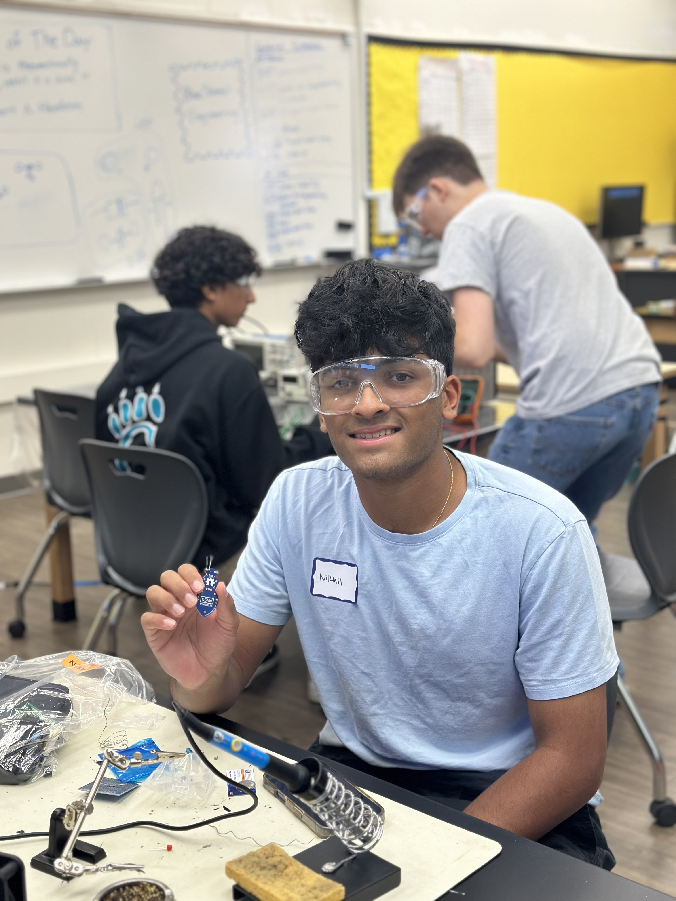
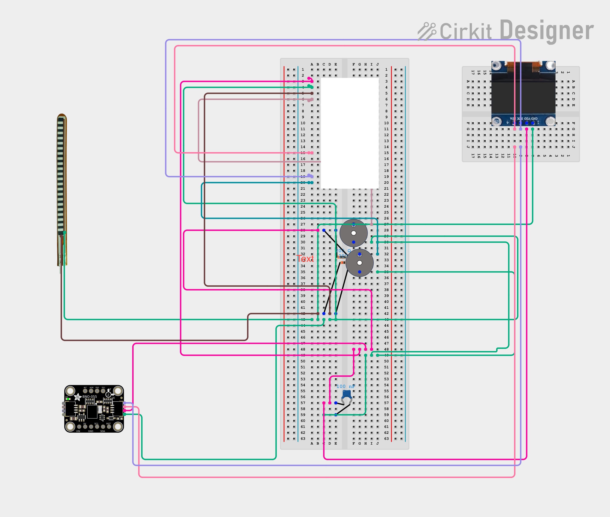

# Knee Rehabilitation Device
Knee brace that informs the user of improper squat form and gives extra help on the squat. For example, it will alert the user if they don't control their squat, alert the user if their knee caves in, and let the user know if they go past 90 degrees. When performing a workout, the user may not be fully aware of what they look like, making this device useful.

| **Engineer** | **School** | **Area of Interest** | **Grade** |
|:--:|:--:|:--:|:--:|
| Nikhil G | Leland High School | Computer Engineering | Incoming Senior




# Final Milestone

<iframe width="560" height="315" src="https://www.youtube.com/embed/7Z7q9Cq5LfI?si=db1NKK2zv_Yjijyu" title="YouTube video player" frameborder="0" allow="accelerometer; autoplay; clipboard-write; encrypted-media; gyroscope; picture-in-picture; web-share" referrerpolicy="strict-origin-when-cross-origin" allowfullscreen></iframe>

My final milestone was kind of just to wrap everything up. I was able to overcome some challenges I already had and I was able to make my project work a lot better. For example, I sewed the flex sensor holders onto the brace. Sewing was a challenge because each stitch had to go through the knee brace and the holders. I also fixed a problem that I had with the accelerometer in the adafruit sensor. The accelerometer detects how gravity acts on it based on the orientation of it. The problem with this is that if the accelerometer was just a little bit disoriented while squatting, the gravity detection would change drastically, sounding the buzzer at an insane rate. I solved this problem by taking the change in values. If there was a large difference between two readings, then that would trigger the buzzer. At Bluestamp Engineering, I have learned a lot about microcontrollers, C++, circuits, even sewing. Some of my biggest challenges here were getting the flex sensor to work and trying to get consistent readings from the sensors. On the other hand, my biggest triumphs include using the magnetometer to detect improper form and calculating the spike in the accelerometer readings. In the future, I hope to learn more about how microcontrollers and electronic circuits can be implemented in biotechnology. 

# Second Milestone

<iframe width="560" height="315" src="https://www.youtube.com/embed/ZlVJFeh6kQg?si=1B_zMx7I6vvsz52L" title="YouTube video player" frameborder="0" allow="accelerometer; autoplay; clipboard-write; encrypted-media; gyroscope; picture-in-picture; web-share" referrerpolicy="strict-origin-when-cross-origin" allowfullscreen></iframe>

With the completion of milestone 2, I have successfully integrated the adafruit sensor into my project. The hardest challenge about this project is the accuracy of the sensors. If I don't get consistent and accurate readings, it is hard to make the project consistent. The adafruit sensor and the flex sensor have both given me these challenges. I realized I could get a much more accurate knee caving warning if I put a magnet on my left knee and used the adafruit's magnetometer. This would measure the magnetic field strength and would beep a buzzer when strength got really high. I also used the adafruit's accelerometer. This would give warnings when the user's squat was not controlled. A previous challenge that I faced that I solved was how I was going to stick the flex sensor on to the knee brace. I decided to use two straw like wire holders that let the flex sensor slide between them and stuck them on with double sided tape. For part of my third milestone, I plan to sew them on. What is surprising about this project, is that I did not think I could do anything like this until now.

# First Milestone

<iframe width="560" height="315" src="https://www.youtube.com/embed/Xit3S94SjW4?si=HXW0kqBgXBtLGmoq" title="YouTube video player" frameborder="0" allow="accelerometer; autoplay; clipboard-write; encrypted-media; gyroscope; picture-in-picture; web-share" referrerpolicy="strict-origin-when-cross-origin" allowfullscreen></iframe>

For my first milestone, I focused on using the flex sensor to detect when the user is squatting. I integrated a piezoeletric buzzer with my flex sensor so the user could be alerted at certain times. I decided to use the values from the flex sensor to create two specific portions of a squat. If the user performs a perfect 90 degree squat, the buzzer will beep at the same rate the whole way through. If the user performs a squat that goes below 90 degrees, the buzzer will beep at a rate double what it normally is. Performing a lower squat is not necessarily harmful, so the buzzer just acts as a warning in this scenario. A challenge I am currently facing is how my flex sensor should stick on the knee brace. I am using tape right now, but the tape does not stick well enough to the brace without getting ripped off. The other important component in my project is the adafruit sensor, or the sensor that combines a magnetometer, gyroscope, and accelerometer into one. I plan to use it to detect improper form. 

# Starter Project

<iframe width="560" height="315" src="https://www.youtube.com/embed/22bG6kSVW3I?si=KxFtkr5e0znGT53O" title="YouTube video player" frameborder="0" allow="accelerometer; autoplay; clipboard-write; encrypted-media; gyroscope; picture-in-picture; web-share" allowfullscreen></iframe>

For my starter project, I chose the jitterbug. It uses a vibration motor, a battery, and two LEDs. It jitters when placed on a hard surface but doesn't work as well on a soft one. A challenge I faced when creating this project was soldering the switch too much, and it ended up breaking altogether.

# Schematics 


# Code
This is my code for the knee device.


```c++
#include <BLEDevice.h>
#include <BLEServer.h>
#include <BLEUtils.h>
#include <BLE2902.h>
#include <Wire.h>
#include <Adafruit_LSM6DS3TRC.h>
#include <Adafruit_LIS3MDL.h>
#include <Adafruit_Sensor.h>
#include <Adafruit_GFX.h>
#include <Adafruit_SSD1306.h>

// --- OLED Display Configuration ---
#define SCREEN_WIDTH 128
#define SCREEN_HEIGHT 64
#define OLED_RESET -1
#define SCREEN_ADDRESS 0x3C

Adafruit_SSD1306 display(SCREEN_WIDTH, SCREEN_HEIGHT, &Wire, OLED_RESET);
bool displayAvailable = false;

// --- BLE Nordic UART Service (NUS) UUIDs ---
#define SERVICE_UUID  "6E400001-B5A3-F393-E0A9-E50E24DCCA9E"
#define CHAR_UUID_TX  "6E400003-B5A3-F393-E0A9-E50E24DCCA9E"
#define CHAR_UUID_RX  "6E400002-B5A3-F393-E0A9-E50E24DCCA9E"

// --- Device Pins ---
#define BUZZER_PIN 4        // Buzzer for IMU/Mag form alerts
const int buzzerPin = 23;   // Buzzer for flex sensor depth pacing
const int flexsensor = 15;  // Flex sensor analog pin

// --- Rehab Thresholds (IMU / Mag) ---
#define ACCEL_SPIKE_THRESHOLD 2.5     // Triggers ONLY if acceleration jumps suddenly between readings
#define TEMPO_ROTATION_THRESHOLD 2.5  // Gyro Z speed limit

float baselineMagnet = 0.0;           
float magnetThreshold = 0.0;          

// Variable to store previous acceleration magnitude for delta tracking
float lastCombinedAccel = 0.0;

Adafruit_LSM6DS3TRC lsm6ds;
Adafruit_LIS3MDL lis3mdl;

// --- Flex Sensor Dynamic Calibration Variables ---
int straightValue = 1850; // Will be auto-calibrated
int ninetyDegrees = 1565; // Calculated dynamically from straightValue

// --- Squat Counter Variables ---
int squatCount = 0;
bool isSquatting = false;

unsigned long lastBeepTime = 0;
bool buzzerState = false;

// --- BLE Globals ---
BLEServer *pServer = nullptr;
BLECharacteristic *pTxCharacteristic = nullptr;
bool deviceConnected = false;

// --- Helper Function: Update OLED Display ---
void updateDisplay(int count) {
  if (!displayAvailable) return;

  display.clearDisplay();
  display.drawRect(0, 0, 128, 64, SSD1306_WHITE);

  // Label
  display.setTextSize(1);
  display.setTextColor(SSD1306_WHITE);
  display.setCursor(28, 10);
  display.println(F("SQUAT COUNT"));

  // Big Counter Text
  display.setTextSize(3);
  
  // Center alignment offset calculation based on digits
  int xPos = 52;
  if (count >= 100) xPos = 38;
  else if (count >= 10) xPos = 45;

  display.setCursor(xPos, 30);
  display.println(count);

  display.display();
}

// --- Helper Function: Send log to BOTH Serial Monitor and BLE UART ---
void sendLog(String msg) {
  Serial.println(msg);
  if (deviceConnected && pTxCharacteristic != nullptr) {
    String bleMsg = msg + "\n";
    pTxCharacteristic->setValue(bleMsg.c_str());
    pTxCharacteristic->notify();
  }
}

class MyServerCallbacks : public BLEServerCallbacks {
  void onConnect(BLEServer *pServer) override {
    deviceConnected = true;
    Serial.println("Device connected via BLE");
  }

  void onDisconnect(BLEServer *pServer) override {
    deviceConnected = false;
    Serial.println("Device disconnected from BLE");
    pServer->getAdvertising()->start();
  }
};

class MyRxCallbacks : public BLECharacteristicCallbacks {
  void onWrite(BLECharacteristic *pCharacteristic) override {
    String rxValue = pCharacteristic->getValue();
    if (rxValue.length() > 0) {
      Serial.print("BLE Received: ");
      Serial.println(rxValue);
    }
  }
};

void setup() {
  Serial.begin(115200);
  while (!Serial) delay(10);

  pinMode(BUZZER_PIN, OUTPUT);
  digitalWrite(BUZZER_PIN, LOW); 
  pinMode(buzzerPin, OUTPUT);
  pinMode(flexsensor, INPUT);

  Wire.begin(21, 22);  // SDA, SCL for ESP32

  // --- Initialize OLED Screen ---
  if (display.begin(SSD1306_SWITCHCAPVCC, SCREEN_ADDRESS)) {
    displayAvailable = true;
    updateDisplay(0);
  } else {
    Serial.println(F("SSD1306 OLED allocation failed!"));
  }

  // --- Initialize Sensors ---
  if (!lsm6ds.begin_I2C()) {
    Serial.println("LSM6DS3TR-C not found!");
    while (1) delay(10);
  }
  
  if (!lis3mdl.begin_I2C()) {
    Serial.println("LIS3MDL not found!");
    while (1) delay(10);
  }

  lis3mdl.setRange(LIS3MDL_RANGE_4_GAUSS); 
  lis3mdl.setDataRate(LIS3MDL_DATARATE_40_HZ);

  // --- Initialize BLE ---
  BLEDevice::init("ESP32 UART");
  pServer = BLEDevice::createServer();
  pServer->setCallbacks(new MyServerCallbacks());

  BLEService *pService = pServer->createService(SERVICE_UUID);

  pTxCharacteristic = pService->createCharacteristic(
                        CHAR_UUID_TX,
                        BLECharacteristic::PROPERTY_NOTIFY);
  pTxCharacteristic->addDescriptor(new BLE2902());

  BLECharacteristic *pRxCharacteristic = pService->createCharacteristic(
                        CHAR_UUID_RX,
                        BLECharacteristic::PROPERTY_WRITE);
  pRxCharacteristic->setCallbacks(new MyRxCallbacks());

  pService->start();
  pServer->getAdvertising()->addServiceUUID(SERVICE_UUID);
  pServer->getAdvertising()->start();
  
  sendLog("BLE UART service started, waiting for connection...");

  // =========================================================================
  // --- 5-Second Magnetometer Calibration Sequence ---
  // =========================================================================
  sendLog("===========================================");
  sendLog("CALIBRATION STARTING IN 2 SECONDS...");
  sendLog("STAND STILL WITH KNEES STRAIGHT!");
  sendLog("===========================================");
  delay(2000);

  float totalMagSample = 0.0;
  int sampleCount = 50; 

  for (int i = 0; i < sampleCount; i++) {
    sensors_event_t mag_event;
    lis3mdl.getEvent(&mag_event);
    
    float magX = mag_event.magnetic.x;
    float magY = mag_event.magnetic.y;
    float magZ = mag_event.magnetic.z;
    totalMagSample += sqrt(magX * magX + magY * magY + magZ * magZ);
    
    if (i % 10 == 0) {
      digitalWrite(BUZZER_PIN, HIGH);
      delay(20);
      digitalWrite(BUZZER_PIN, LOW);
    }
    
    delay(100);
  }

  baselineMagnet = totalMagSample / sampleCount;
  magnetThreshold = baselineMagnet + 15.0; 

  // Initialize baseline acceleration
  sensors_event_t accel, gyro, temp;
  lsm6ds.getEvent(&accel, &gyro, &temp);
  lastCombinedAccel = sqrt(accel.acceleration.y * accel.acceleration.y + accel.acceleration.z * accel.acceleration.z);

  sendLog("--- IMU/MAG CALIBRATION COMPLETE ---");
  sendLog("Baseline Magnet Strength: " + String(baselineMagnet) + " uT");
  sendLog("Target Beep Threshold: " + String(magnetThreshold) + " uT");
  sendLog("===========================================");

  // =========================================================================
  // --- 5-Second Flex Sensor Calibration Sequence ---
  // =========================================================================
  sendLog("Starting 5-second flex sensor calibration...");
  sendLog("Please hold your leg STRAIGHT and still!");

  for (int i = 0; i < 3; i++) {
    tone(buzzerPin, 1500);
    delay(100);
    noTone(buzzerPin);
    delay(100);
  }

  unsigned long startCalibration = millis();
  long totalReading = 0;
  int readingCount = 0;

  while (millis() - startCalibration < 5000) {
    totalReading += analogRead(flexsensor);
    readingCount++;
    delay(20);
  }

  if (readingCount > 0) {
    straightValue = totalReading / readingCount;
    ninetyDegrees = straightValue - 250; 
  }

  tone(buzzerPin, 2000);
  delay(500);
  noTone(buzzerPin);

  sendLog("Flex Calibration complete!");
  sendLog("Calibrated Straight Value: " + String(straightValue));
  sendLog("Calculated 90 Degrees Value: " + String(ninetyDegrees));
  sendLog("===========================================");
}

void loop() {
  // --- Read IMU & Magnetometer Sensors ---
  sensors_event_t accel, gyro, temp;
  lsm6ds.getEvent(&accel, &gyro, &temp);

  sensors_event_t mag_event;
  lis3mdl.getEvent(&mag_event);

  bool badFormDetected = false;

  // --- 1. Magnetometer ---
  float magX = mag_event.magnetic.x;
  float magY = mag_event.magnetic.y;
  float magZ = mag_event.magnetic.z;
  float magnitude = sqrt(magX * magX + magY * magY + magZ * magZ);

  if (magnitude > magnetThreshold) {
    sendLog("--- WARNING: Knees Caving In (Magnetometer)! ---");
    badFormDetected = true;
  }

  // --- 2. Accelerometer: Spike-Only Detection ---
  float currentCombinedAccel = sqrt(accel.acceleration.y * accel.acceleration.y + 
                                    accel.acceleration.z * accel.acceleration.z);

  float accelDelta = abs(currentCombinedAccel - lastCombinedAccel);

  if (accelDelta > ACCEL_SPIKE_THRESHOLD) {
    sendLog("--- WARNING: Fast Drop Spike Detected! ---");
    badFormDetected = true;
  }

  lastCombinedAccel = currentCombinedAccel;

  // --- 3. Gyroscope: Backup Tempo Control ---
  if (abs(gyro.gyro.z) > TEMPO_ROTATION_THRESHOLD) {
    sendLog("--- WARNING: Moving Too Fast! ---");
    badFormDetected = true;
  }

  // --- IMU Action Window ---
  if (badFormDetected) {
    digitalWrite(BUZZER_PIN, HIGH); 
    delay(100);                      
    digitalWrite(BUZZER_PIN, LOW);   
  }

  // --- Send Telemetry Data to Serial Monitor and BLE ---
  String imuLog = "Mag: " + String(magnitude) + " uT | Accel Delta (Spike): " + 
                   String(accelDelta) + " | Accel Total: " + String(currentCombinedAccel);
  sendLog(imuLog);

  // --- 4. Flex Sensor & Squat Counter Logic ---
  int value = analogRead(flexsensor);
  sendLog("Flex Sensor: " + String(value));

  // Thresholds for detecting flex (down) and returning (up)
  int flexDownThreshold = straightValue - 150; // Knee is bending downwards
  int flexUpThreshold = straightValue - 50;    // Knee returned near straight position

  // State Machine logic to count reps safely without false double-counts
  if (!isSquatting && value < flexDownThreshold) {
    isSquatting = true; 
  } else if (isSquatting && value > flexUpThreshold) {
    isSquatting = false;
    squatCount++;
    updateDisplay(squatCount);
    sendLog("Squat Completed! Total: " + String(squatCount));
  }

  // --- 5. Flex Sensor Depth Pacing Window ---
  unsigned long currentMillis = millis();
  int beepInterval = 0;

  if (value < ninetyDegrees) {
    beepInterval = 150; 
  } else if (value >= ninetyDegrees && value <= straightValue + 50) {
    beepInterval = 600; 
  } else {
    noTone(buzzerPin);
    beepInterval = 0; 
  }

  if (beepInterval > 0) {
    if (currentMillis - lastBeepTime >= beepInterval) {
      lastBeepTime = currentMillis;
      buzzerState = !buzzerState;

      if (buzzerState) {
        tone(buzzerPin, 1000);
      } else {
        noTone(buzzerPin);
      }
    }
  }

  delay(100); // Loop interval
}
```

# Bill of Materials
Here's where you'll list the parts in your project. To add more rows, just copy and paste the example rows below.
Don't forget to place the link of where to buy each component inside the quotation marks in the corresponding row after href =. Follow the guide [here]([url](https://www.markdownguide.org/extended-syntax/)) to learn how to customize this to your project needs. 

| **Part** | **Note** | **Price** | **Link** |
|:--:|:--:|:--:|:--:|
| ESP32 | Microcontroller | $9.99 | <a href="https://www.amazon.com/HiLetgo-ESP-WROOM-32-Development-Microcontroller-Integrated/dp/B0718T232Z/ref=sr_1_2_sspa?dib=eyJ2IjoiMSJ9.XBINg-sjhfF_gUtnMiKGjk-Cz998LZHcErnfMs35F-D1UBTQK0-lGM-qH6ZcD8355cFxkVk9DmW5LzbBSZW_JUFJJM1mJ1WCKzY5PHdZadqvVYK1ZcdaE3gZRaJWI9yhfhQjvrV_bU3UFxs5nre2LDjLD_w8XI4NndkxNKxSg7GiTVHrLYkao8OovfhPK-5JWRhxCx9qaof23bUI9GDWF2YuvWSYm7x1TQ1HKNrQ8Hs.O7oZEpnOTKWX2Bf_X5HJU8sGsDOaEkQidMod-rnwEmE&dib_tag=se&keywords=ESP32&qid=1782403894&sr=8-2-spons&sp_csd=d2lkZ2V0TmFtZT1zcF9hdGY&th=1"> Link </a> |
| Adafruit LSM6DS3TR + LIS3MDI | Accelerometer, gyroscope, magnetometer all in one| $16.00 | <a href="https://www.amazon.com/NebulaGo-1pcs-LSM6DS3TR-C-LSM6DS3TR-Sensor/dp/B0GZKTJHH9/ref=sr_1_2?crid=UT0UTEB5Y1K8&dib=eyJ2IjoiMSJ9.ObybggRZITOBjOSSbvHpapXa-qIxX5fT1GuqmfBi8HzFfvaBo0bDRpTHwO0hKZHdEKnVwO4OcSqk_qtGU7ipP2Clo2Y-E67AEkn_QVLCV4DLZkOyb-w8jQiEdp0C4y4X58Z2F67nBJ_oN1m4ZP2N7NXOGGL0nHcgNPv51SHaduHsWU_dhEDieV3t5wJWtFwIrbEjrraKuB6n5C_595-D7MmXJpX4re_L6O2KlPYb9R0.ka4QfqfVW1VYb_hkczvbr3qMv-em8Q61mJEm5JnHLDo&dib_tag=se&keywords=adafruit+lsm6ds3tr&qid=1782404026&sprefix=adafruit+lsm6ds3%2Caps%2C222&sr=8-2"> Link </a> |
| Breadboard | To build electronic circuits | $8.99 | <a href="[https://www.amazon.com/Arduino-A000066-ARDUINO-UNO-R3/dp/B008GRTSV6/](https://www.amazon.com/EL-CP-003-Breadboard-Solderless-Distribution-Connecting/dp/B01EV6LJ7G/ref=sr_1_4?crid=1WNXN8N29ULMV&dib=eyJ2IjoiMSJ9.eV9nARvK2S1_-r45I8kSDw-6sDNnN2BV6ymYerOMBRETjogMKB7zIo8u_TUoaq3Nf4BWLGXY_VfIsjEj56XIYwFArjMqg5_XXl4fWqPWE2DQln3CyZGrGkLzT52Zt1u8Beazlk9iVA8syNZwD3qcDQEfSANeqIIdGQHHd9wkf33m-3Yy3jVTgwQ0rsP4p-w1LLJdjURUoKgTluD3QTX2QY1C54aDwhm2zF8J9aQAXcg.73CPJ0vHuiyuG6z-Rsx8uxTXFq4mv1VEHVMPtWm37OE&dib_tag=se&keywords=breadboard&qid=1782404174&sprefix=bread%2Caps%2C629&sr=8-4)"> Link </a> |
| Jumper Cables | To create electronic circuits| $6.98 | <a href="amazon.com/Elegoo-EL-CP-004-Multicolored-Breadboard-arduino/dp/B01EV70C78/ref=sr_1_1_sspa?dib=eyJ2IjoiMSJ9.tjHxIQLJsk16_0YVtUGN6erd5BDBwPCXF98pEA_v-6tW0uIJNcxP0JAFE2Cjf_Aa3N5_ANLgxFmssXKTHpG2laeCxmNzgFO0GJ7WkU0Q6WIR2p9DpkmZphRZE5-kHpxMptr_LDWvSy44fYm-dVBDR3Ax0DaH-tSgGHOpvORHASv-K5FquVnjjcescHZm9Go9Kk0mTgPOkgE8KmJRF6rOAmwCAfhqQedcVPAVb08GBM4P3qOwqFykYh_vO3FmwU8JW0WFQJmUQ6AlwcyeW6mNqZA_APumbE_K56Bgn_dMbVo.JKiP2HiFyYzH07vqTJMGjX4EBDIQPoxxXIvgjvSuUHo&dib_tag=se&keywords=breadboard+jumper+wires&qid=1783962289&s=electronics&sr=1-1-spons&sp_csd=d2lkZ2V0TmFtZT1zcF9hdGY&psc=1"> Link </a> |
| Flex Sensor | Getting values when the sensor is bent| $15.67 | <a href="[https://www.amazon.com/Arduino-A000066-ARDUINO-UNO-R3/dp/B008GRTSV6/](https://www.amazon.com/Spectra-Symbol-Flex-Sensor-Variant/dp/B0D3FFWJZ9/ref=sr_1_2_sspa?dib=eyJ2IjoiMSJ9.XO7Kj1ekhXXu5p7ofrmZO-SlnTXzHhLaY80hWH3zlYBDV0sdh7SE1aR6A1nHbv4t43Ke9WahkbQhdm_4hhqr7oTqifJfthhs_0N2VKScHfosP4cRpoKePe1_UUgdzPeBDWEwCYt-aMpufQcd2ln7eF3YdmZKq2vIx6K4QpnzpsryldXm31t-cN3xb5CwbNbwogYjgNI6CTi5K-B6bag_8gReyI09k4c8b0so07oMqmI.g_PrCMD2FpJczzdOOO7vEbIfagyuVqdX8we6beqw-AA&dib_tag=se&keywords=flex+sensor&qid=1783962225&sr=8-2-spons&sp_csd=d2lkZ2V0TmFtZT1zcF9hdGY&psc=1)"> Link </a> |
| Piezo Buzzer | Making sound when told to do so | $5.99 | <a href="[https://www.amazon.com/Arduino-A000066-ARDUINO-UNO-R3/dp/B008GRTSV6/](https://www.amazon.com/Passive-Resistance-Electronic-Magnetic-Continuous/dp/B0F1KFHSNK/ref=sr_1_1_sspa?dib=eyJ2IjoiMSJ9.Kc1lRhz-FXgslMSBkHup9x5It0lsf8CxJn4BUQ5uZ9lFme6J5q4hpGn_mBpM-ZFiWwcj6nS-JMXqtJDl_r0H0Nx1CMJxLRtrPoxnHFIwW7fVd1ym9hRGkY-_Aj-kAOW4XPPLDH0iF_oNLLJAo5faWNa-xx4dwTis40f-WnLKR3qS2Fz9FC9YD5gBqeO7yHC1w-usuqdLBEbmMXIroeLs7suUIZ3bIgjjTkNQruvXwVk.9m0W9mNVwDxAVIR8oV0TDMWVHyzvxV0_YG_wNfxzc-M&dib_tag=se&keywords=piezo%2Bbuzzer&qid=1783962365&sr=8-1-spons&sp_csd=d2lkZ2V0TmFtZT1zcF9hdGY&th=1)"> Link </a> |
| USB-C Cable | Connecting from USB-C to USB-C | $Price | <a href="amazon.com/Anker-Charging-MacBook-Galaxy-Charger/dp/B088NRLMPV/ref=sr_1_3?dib=eyJ2IjoiMSJ9.oD_EH9aZtLqkp1r6B_7OhCBpgOkphhIVYLGv0ywtjAkFI0fEDIpRKRWB9rOtrTCOj7RwHMREt7dpZRpo4kQCLwHGcfEbdDTJLhvaXqm0xlKpoJ4XXoT57DJdNkW6FgrTDwV1cqYc8O6ktPAoELyxAN5JGmfo2dfIk43PLwPO0bY1bQbl9KIYkHND3_G8QnO3lO6_G5TtSxGOlHYKelt7eU22W5r77kU4fcGnH2F0Dtk.EsiUiQG4xnlaODxmNfQ2KXhG1nPy6jhU4gEgdXpJYd8&dib_tag=se&keywords=usb-c+cable&qid=1783962452&sr=8-3"> Link </a> |
| 30kΩ Resistors | Restricts electric current | $5.49 | <a href="[https://www.amazon.com/Arduino-A000066-ARDUINO-UNO-R3/dp/B008GRTSV6/](https://www.amazon.com/Resistor-Tolerance-Resistors-Limiting-Certificated/dp/B08QS2QGSP/ref=sr_1_1_sspa?crid=4LS8EKIHI2CJ&dib=eyJ2IjoiMSJ9.r5iF8E6n3nbmwtxtdAl7avbZ8dfzvl7ntiLM2RYVj2oJ334GfuXxtapSsGRDXg4_-nhtphwpa_T-J1nHhHMmb7Bs47vaMZ1MgAK3gogqBDKq6EdG7pwNKZeNKOwVr0Gxxw7BVdG9w93Dg9awC70uNJEykPHfiAabRQaElJhPJude_Vg64a_e1hp9lG57_4RaqvvYikIUdMEn3i6LqSOkEbdArLbMBqUB-P212ER6GbY.ZMJeudZCa9q78cp-zCYSJImN9fADh4bUGNYtQogNMdU&dib_tag=se&keywords=30k%2Bresistors&qid=1783962529&sprefix=30k%2Bresisto%2Caps%2C169&sr=8-1-spons&sp_csd=d2lkZ2V0TmFtZT1zcF9hdGY&th=1)"> Link </a> |
| Knee Brace | Supports joint in knee | $12.99 | <a href="amazon.com/Compression-Sleeve-Support-Running-Medium/dp/B0987XL3WV/ref=sr_1_3_sspa?crid=20JN22CFZXQSI&dib=eyJ2IjoiMSJ9.IKCiVSGWgkohtZFPwLqD45RJC5HyDyE9b8750p7lhcav7vL6jWatvWZcI62iWaoNB1zQ2jckHu-1dMVloIxgdVFH2E_HgNax5SvnrWOx7Ve4WiBr_lDG2BLx-lTlcs3VJGbxYhB2OVkqHogXbvvNmoYaHjeCj81hmx-XnphpnElrEATLVOICZk_v9Vth90AEht7crRFfVdb4BVfXnw6M1cBb2dGzTrxEwXdOJIgpnUo_qRcs9vB5tXqKYeTUWxWo9Yi_7fIGx8M7uiSlv-AJFuNZbddq_G_fgzPDn2kOL8w.BvCykKDhilbfhhR6JZnCp9z9CLfnzGOqp8Gwd1Dg-ig&dib_tag=se&keywords=knee+brace&qid=1783962619&sprefix=knee+%2Caps%2C481&sr=8-3-spons&sp_csd=d2lkZ2V0TmFtZT1zcF9hdGY&psc=1"> Link </a> |
| Item Name | What the item is used for | $Price | <a href="https://www.amazon.com/Arduino-A000066-ARDUINO-UNO-R3/dp/B008GRTSV6/"> Link </a> |


# Other Resources/Examples
One of the best parts about Github is that you can view how other people set up their own work. Here are some past BSE portfolios that are awesome examples. You can view how they set up their portfolio, and you can view their index.md files to understand how they implemented different portfolio components.
- [Example 1](https://trashytuber.github.io/YimingJiaBlueStamp/)
- [Example 2](https://sviatil0.github.io/Sviatoslav_BSE/)
- [Example 3](https://arneshkumar.github.io/arneshbluestamp/)

To watch the BSE tutorial on how to create a portfolio, click here.
