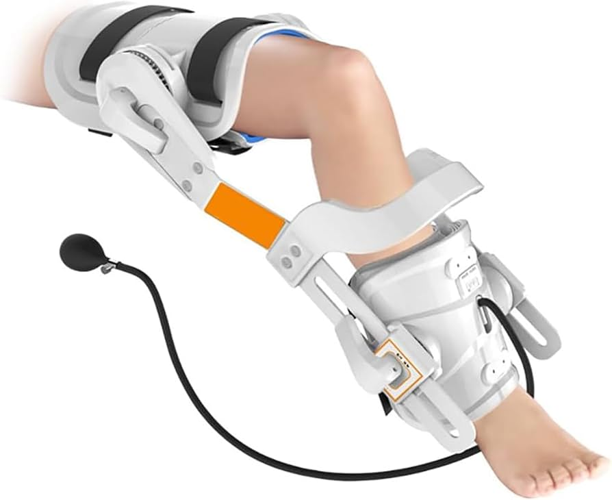

# Knee Rehabilitation Device
Knee brace that informs the user of improper squat form and gives extra help on the squat. For example, it will count squats, give a wall-sit timer, and let the user know if they go past 90 degrees. When performing a workout, the user may not be fully aware of what they look like, making this device useful. test12343

You should comment out all portions of your portfolio that you have not completed yet, as well as any instructions:
```HTML 
<!--- This is an HTML comment in Markdown -->
<!--- Anything between these symbols will not render on the published site -->
```

| **Engineer** | **School** | **Area of Interest** | **Grade** |
|:--:|:--:|:--:|:--:|
| Nikhil G | Leland High School | Electrical Engineering | Incoming Senior




# Final Milestone

**Don't forget to replace the text below with the embedding for your milestone video. Go to Youtube, click Share -> Embed, and copy and paste the code to replace what's below.**

<iframe width="560" height="315" src="https://www.youtube.com/embed/F7M7imOVGug" title="YouTube video player" frameborder="0" allow="accelerometer; autoplay; clipboard-write; encrypted-media; gyroscope; picture-in-picture; web-share" allowfullscreen></iframe>

For your final milestone, explain the outcome of your project. Key details to include are:
- What you've accomplished since your previous milestone
- What your biggest challenges and triumphs were at BSE
- A summary of key topics you learned about
- What you hope to learn in the future after everything you've learned at BSE


# Second Milestone

**Don't forget to replace the text below with the embedding for your milestone video. Go to Youtube, click Share -> Embed, and copy and paste the code to replace what's below.**

<iframe width="560" height="315" src="https://www.youtube.com/embed/y3VAmNlER5Y" title="YouTube video player" frameborder="0" allow="accelerometer; autoplay; clipboard-write; encrypted-media; gyroscope; picture-in-picture; web-share" allowfullscreen></iframe>

For your second milestone, explain what you've worked on since your previous milestone. You can highlight:
- Technical details of what you've accomplished and how they contribute to the final goal
- What has been surprising about the project so far
- Previous challenges you faced that you overcame
- What needs to be completed before your final milestone 

# First Milestone

**Don't forget to replace the text below with the embedding for your milestone video. Go to Youtube, click Share -> Embed, and copy and paste the code to replace what's below.**

<iframe width="560" height="315" src="https://www.youtube.com/embed/CaCazFBhYKs" title="YouTube video player" frameborder="0" allow="accelerometer; autoplay; clipboard-write; encrypted-media; gyroscope; picture-in-picture; web-share" allowfullscreen></iframe>

For your first milestone, describe what your project is and how you plan to build it. You can include:
- An explanation about the different components of your project and how they will all integrate together
- Technical progress you've made so far
- Challenges you're facing and solving in your future milestones
- What your plan is to complete your project

# Starter Project

**Don't forget to replace the text below with the embedding for your milestone video. Go to Youtube, click Share -> Embed, and copy and paste the code to replace what's below.**

<iframe width="560" height="315" src="https://www.youtube.com/embed/22bG6kSVW3I?si=KxFtkr5e0znGT53O" title="YouTube video player" frameborder="0" allow="accelerometer; autoplay; clipboard-write; encrypted-media; gyroscope; picture-in-picture; web-share" allowfullscreen></iframe>

For my starter project, I chose the jitterbug. It uses a vibration motor, a battery, and two LEDs. It jitters when placed on a hard surface but doesn't work as well on a soft one. A challenge I faced when creating this project was soldering the switch too much, and it ended up breaking altogether.

# Schematics 
Here's where you'll put images of your schematics. [Tinkercad](https://www.tinkercad.com/blog/official-guide-to-tinkercad-circuits) and [Fritzing](https://fritzing.org/learning/) are both great resoruces to create professional schematic diagrams, though BSE recommends Tinkercad becuase it can be done easily and for free in the browser. 

# Code
Here's where you'll put your code. The syntax below places it into a block of code. Follow the guide [here]([url](https://www.markdownguide.org/extended-syntax/)) to learn how to customize it to your project needs. 


```c++
void setup() {
  // put your setup code here, to run once:
  Serial.begin(9600);
  Serial.println("Hello World!");
}

void loop() {
  // put your main code here, to run repeatedly:

}
```

# Bill of Materials
Here's where you'll list the parts in your project. To add more rows, just copy and paste the example rows below.
Don't forget to place the link of where to buy each component inside the quotation marks in the corresponding row after href =. Follow the guide [here]([url](https://www.markdownguide.org/extended-syntax/)) to learn how to customize this to your project needs. 

| **Part** | **Note** | **Price** | **Link** |
|:--:|:--:|:--:|:--:|
| ESP32 | Microcontroller | $9.99 | <a href="https://www.amazon.com/HiLetgo-ESP-WROOM-32-Development-Microcontroller-Integrated/dp/B0718T232Z/ref=sr_1_2_sspa?dib=eyJ2IjoiMSJ9.XBINg-sjhfF_gUtnMiKGjk-Cz998LZHcErnfMs35F-D1UBTQK0-lGM-qH6ZcD8355cFxkVk9DmW5LzbBSZW_JUFJJM1mJ1WCKzY5PHdZadqvVYK1ZcdaE3gZRaJWI9yhfhQjvrV_bU3UFxs5nre2LDjLD_w8XI4NndkxNKxSg7GiTVHrLYkao8OovfhPK-5JWRhxCx9qaof23bUI9GDWF2YuvWSYm7x1TQ1HKNrQ8Hs.O7oZEpnOTKWX2Bf_X5HJU8sGsDOaEkQidMod-rnwEmE&dib_tag=se&keywords=ESP32&qid=1782403894&sr=8-2-spons&sp_csd=d2lkZ2V0TmFtZT1zcF9hdGY&th=1"> Link </a> |
| Adafruit LSM6DS3TR + LIS3MDI | Accelerometer, gyroscope, magnetometer all in one| $16.00 | <a href="https://www.amazon.com/NebulaGo-1pcs-LSM6DS3TR-C-LSM6DS3TR-Sensor/dp/B0GZKTJHH9/ref=sr_1_2?crid=UT0UTEB5Y1K8&dib=eyJ2IjoiMSJ9.ObybggRZITOBjOSSbvHpapXa-qIxX5fT1GuqmfBi8HzFfvaBo0bDRpTHwO0hKZHdEKnVwO4OcSqk_qtGU7ipP2Clo2Y-E67AEkn_QVLCV4DLZkOyb-w8jQiEdp0C4y4X58Z2F67nBJ_oN1m4ZP2N7NXOGGL0nHcgNPv51SHaduHsWU_dhEDieV3t5wJWtFwIrbEjrraKuB6n5C_595-D7MmXJpX4re_L6O2KlPYb9R0.ka4QfqfVW1VYb_hkczvbr3qMv-em8Q61mJEm5JnHLDo&dib_tag=se&keywords=adafruit+lsm6ds3tr&qid=1782404026&sprefix=adafruit+lsm6ds3%2Caps%2C222&sr=8-2"> Link </a> |
| Breadboard | To build electronic circuits | $8.99 | <a href="[https://www.amazon.com/Arduino-A000066-ARDUINO-UNO-R3/dp/B008GRTSV6/](https://www.amazon.com/EL-CP-003-Breadboard-Solderless-Distribution-Connecting/dp/B01EV6LJ7G/ref=sr_1_4?crid=1WNXN8N29ULMV&dib=eyJ2IjoiMSJ9.eV9nARvK2S1_-r45I8kSDw-6sDNnN2BV6ymYerOMBRETjogMKB7zIo8u_TUoaq3Nf4BWLGXY_VfIsjEj56XIYwFArjMqg5_XXl4fWqPWE2DQln3CyZGrGkLzT52Zt1u8Beazlk9iVA8syNZwD3qcDQEfSANeqIIdGQHHd9wkf33m-3Yy3jVTgwQ0rsP4p-w1LLJdjURUoKgTluD3QTX2QY1C54aDwhm2zF8J9aQAXcg.73CPJ0vHuiyuG6z-Rsx8uxTXFq4mv1VEHVMPtWm37OE&dib_tag=se&keywords=breadboard&qid=1782404174&sprefix=bread%2Caps%2C629&sr=8-4)"> Link </a> |
| Item Name | What the item is used for | $Price | <a href="https://www.amazon.com/Arduino-A000066-ARDUINO-UNO-R3/dp/B008GRTSV6/"> Link </a> |


# Other Resources/Examples
One of the best parts about Github is that you can view how other people set up their own work. Here are some past BSE portfolios that are awesome examples. You can view how they set up their portfolio, and you can view their index.md files to understand how they implemented different portfolio components.
- [Example 1](https://trashytuber.github.io/YimingJiaBlueStamp/)
- [Example 2](https://sviatil0.github.io/Sviatoslav_BSE/)
- [Example 3](https://arneshkumar.github.io/arneshbluestamp/)

To watch the BSE tutorial on how to create a portfolio, click here.
